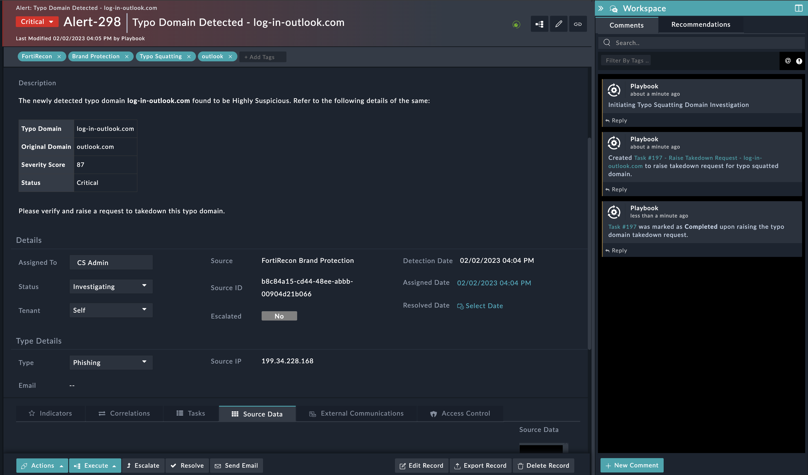

| [Home](../README.md) |
|----------------------|
# Usage

Refer to [Simulate Scenario documentation](https://github.com/fortinet-fortisoar/solution-pack-soc-simulator/blob/develop/docs/usage.md) to understand how to simulate and reset scenarios.

To understand the process FortiSOAR follows to respond to alerts related to typo squatted domain and rogue mobile app, we have included a scenario &mdash; **Typo Squatting Domain** and **Rogue Mobile App** with this solution pack.

## Typo Squatting Domain Scenario

This scenario generates an example alert of Type *Phishing* in FortiSOAR's **Alerts** module.

Navigate to demo alert and note the following:

- The demo alert created is an example of FortiRecon Brand Protection detecting a typo domain that is *Highly Suspicious*
- The alert is of type *Phishing*
- The reported alert contains the following among other related sources data:
    - Typo Domain Details:
        - Typo Domain
        - Original Domain
        - Severity Score
        - Status
    - Source
    - Source ID
    - Source IP
    - Also indicators get created for typo domain and Source IP Address

- The response playbooks `High Risk Typo Domain Response` runs on update of alert status when all the indicators are extracted and enriched
    - This playbook creates a manual task of type *Takedown Request* to raise takedown request for high risk typo domain
    - Once typo domain takedown request raised, user should mark task as *Completed*

    

## Rogue Mobile App Scenario

This scenario generates an example alert of Type *Phishing* in FortiSOAR's **Alerts** module.

Navigate to demo alert and note the following:

- The demo alert created is an example of FortiRecon Brand Protection detecting a *Rogue Mobile App*
- The alert is of type *Phishing*
- The reported alert contains the following information among other related sources data:
    - Rogue Moblie App Details:
        - Name
        - Source
        - Developer
        - Status
        - Size
        - Download Count
    - Source
    - Source ID

- The response playbooks `High Risk Rogue Mobile App Response` runs on update of alert status when all the indicators are extracted and enriched
    - This playbook creates a manual task of type *Takedown Request* to raise takedown request for high risk rogue mobile app
    - Once rogue moile app takedown request raised, user should mark task as *Completed*

    

